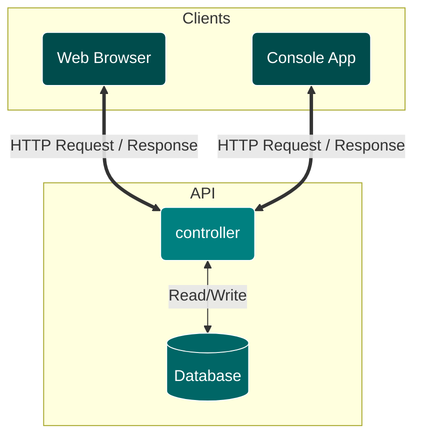

# My User API

---
- [x] Create a API project
- [x] Add swagger page
- [ ] Add CRUD endpoints
---
* An HTTP **Client**, such as web browser or app, sends a request as shown below:
```
GET /users HTTP/1.1
Host: http://localhost
Accept-Language: en-us
```
* The host (controller) process the request and sends a response as shown below:
```json
[
  {
    "id": 1,
    "name": "Jon",
    "email": "jon.doe@email.com"
  },
  {
    "id": 2,
    "name": "Jane",
    "email": "jane.doe@email.com"
  }
]
```

* Here's a flowchart showing interactions between different components:


---
* [Tutorial: Create a web API with ASP.NET Core](https://learn.microsoft.com/en-us/aspnet/core/tutorials/first-web-api?WT.mc_id=dotnet-35129-website&view=aspnetcore-7.0&tabs=visual-studio)